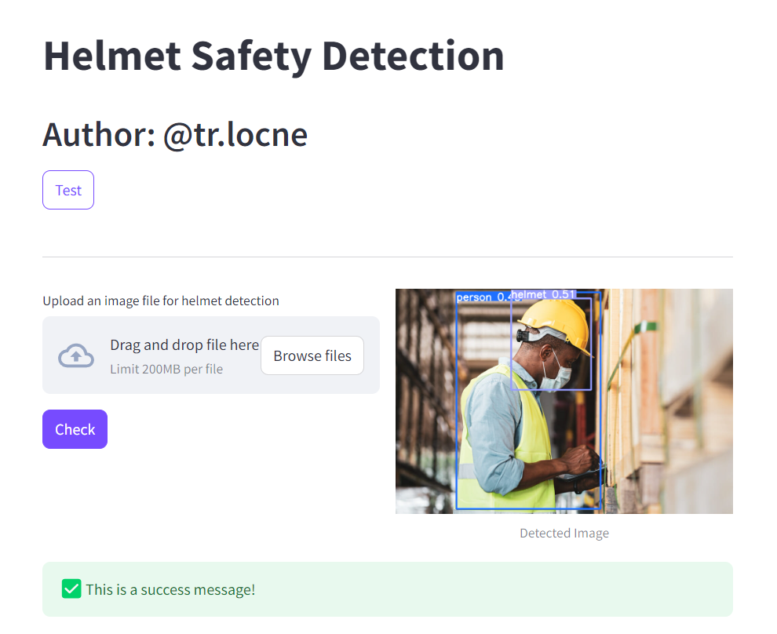
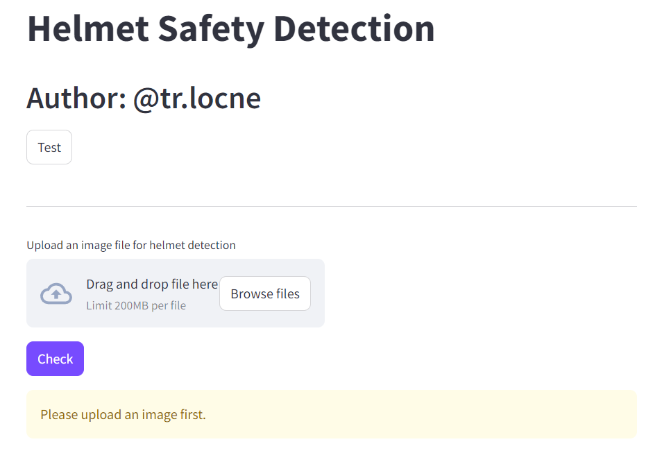

## Working Safety Monitoring Using Yolov10

### Overview 
**Working Safety Monitoring with Yolov10** is a project of the AIO2024 course that aims to monitor whether workers wear safety helmets during work or not.

### Getting Started

1. **Clone the Repository**:
   ```bash
   git clone https://github.com/trlocne/AIO2024-Exercise.git
   cd AIO2024-Exercise
   ```

2. **Install Dependencies**:
   Make sure you have Python installed. Install the required dependencies using pip:
   ```bash
   pip install -q -r requirements.txt
   ```

### Result



### Contact

For questions, suggestions, or feedback, please open an issue on GitHub or reach out via [tr.locne204@gmail.com].

---

By providing a clear and detailed description, this repository aims to facilitate learning and improve proficiency in AIO tasks for developers and data scientists alike.